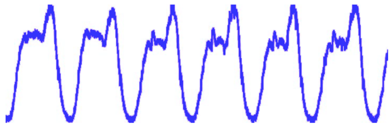

Time Series Challenge
--------------------

# About 

This is firs challenge and is about time series - KPI data and anomaly prediction.

# Description

KPI anomaly detection refers to the analysis of KPI time series data by an algorithm to determine whether it has abnormal behavior.   
The main difficulties here are:

1. The frequency of abnormalities is very low. In actual operation and maintenance scenarios, exceptions rarely occur in the business system, so there are few exception data available for analysis. 
2. Variety of abnormal species. Because the actual business system is very complex and will be continuously updated and upgraded, the types of failures are various, resulting in the diversity of abnormal types. 
3. KPI diversity. KPIs are characterized by periodicity, stable performance, unstable performance, and persistent fluctuations.

Periodic KPI

Stable KPI

Unstable KPI

# Data

The training KPI data, includes four columns: KPI ID, timestamp, value, and label if value is abnormal.

[TRAIN data](data/train.zip)  

| KPI ID | Timestamp | Value  | Label |
| ------ | ---------:| ------:| -----:|
|0|1503831000|10.8|0|
|0|1503831060|12.3|1|
|...|...|...|...|

Data set description: The data set includes 4 columns: KPI ID, time stamp, value, label.   
*Please note that this dataset contains data missing points (found by the time stamp).*

Label: 0 = a normal data point, and 1 = an abnormal data point.

The test KPI data:.
[TEST data](data/test.zip)
|KPI ID|Timestamp|Value|  
|-----|-----:|-----:|  
|0|1503831000|10.8|  
|0|1503831060|12.3| 
|...|...|...|

# GOAL
Find all anomalies with different types of KPIs.

## Week 1 - Data cleaning
Train data contains multiple KPIs in one file:
- split each KPI into separate file
- for each KPI get characteristics: min, max, medium, sigma 
- discussion: 
    - How many types of KPI do we have here?
    - Could you from this data easily segregate each KPI into each type of KPI?
    - Is there algorithm that could automatically segregate KPIS into different categories?  

## Week 2 - Data characteristics / Visualisation
For each KPI:
- get distribution / histogram - how to build optimal histogram ?
- provide visualisation in time - can you spot anomalies?
- provide visualisation in time with labeled anomalies
- discussion:
    - looking at distribution and visualisation in time can you predict what type of KPI it is?
    - as above - can you see indicators of abnormal behaviour?

## Week 3 - Weighting Averages

## Week 4 - ARIMA

## Week 5 - RNN

